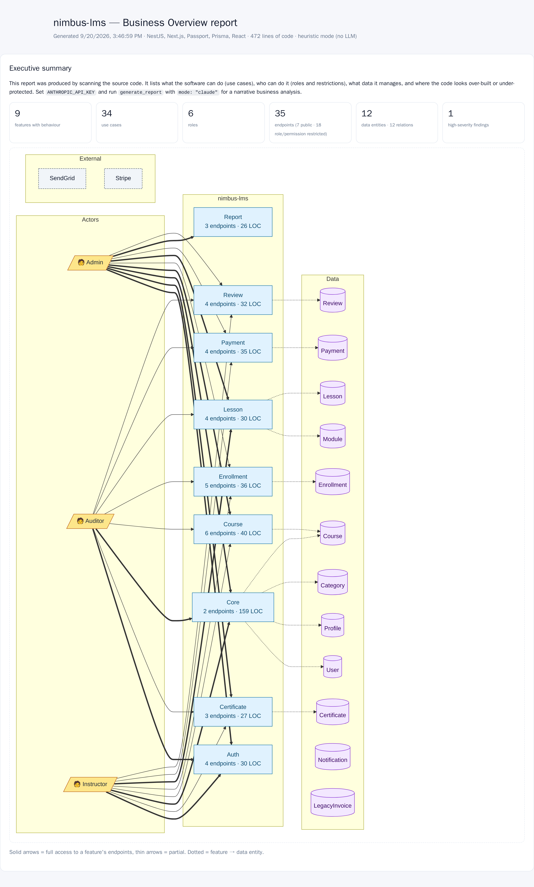
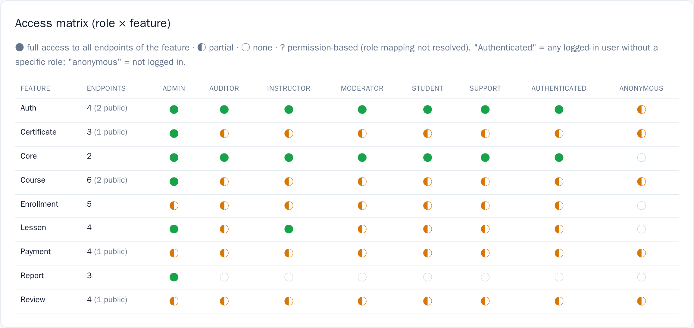
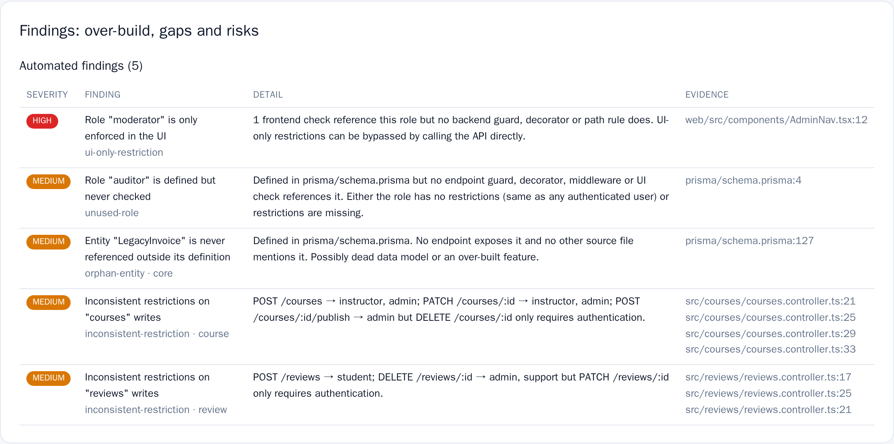
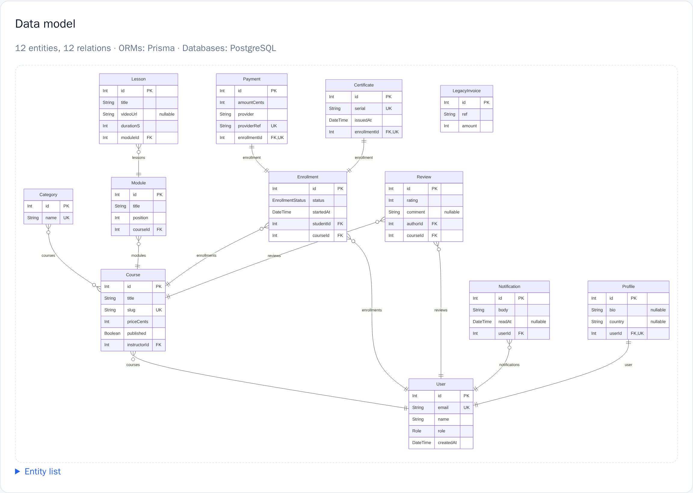

# Business Overview MCP

**Point it at a codebase. Get back what the software actually does, who is allowed to do it, and where the rules are missing.**

An [MCP](https://modelcontextprotocol.io) server that reads source code and answers the questions a founder, a product owner, or a new engineer actually asks: what features exist, what can each role do, what data do we hold, and what did we build that nobody uses?

It was written for a specific problem. AI coding agents now ship features faster than anyone can keep track of them. The code works, but nobody holds the full picture any more: which roles exist, what each one can reach, which rules are enforced on the server and which only in the UI. This reads the code and rebuilds that picture, with a file and line number behind every claim.

No LLM is required. Everything below is extracted from source with parsers, so it is fast, free, and deterministic. Claude is optional, and only adds the narrative layer on top.

```
scan_project root=/path/to/project     →  features, roles, endpoints, data, stack
generate_report root=/path/to/project  →  a shareable HTML report
```



## What you get

**A role × feature access matrix.** Who can reach what, at a glance. `●` full access, `◐` partial, `○` none.



**Findings that point at real problems**, each with a file and line: rules enforced only in the browser, roles defined but never checked, write endpoints with no authentication, inconsistent rules on the same resource, tables nothing reads.



**A data model you did not have to draw.** Entities, fields, keys and relations, recovered from whichever ORM the project uses.



Plus a feature inventory, use cases per role, a C4 container diagram, a module dependency graph, and per-endpoint sequence diagrams. Diagrams come out as Mermaid or PlantUML, so they render in GitHub, VS Code, Notion and Confluence, and the report is a single self-contained HTML file you can email to someone non-technical.

## Install

Node 20+, or Docker if you prefer not to install anything.

```bash
git clone https://github.com/fadiroot/business-overview-mcp.git
cd business-overview-mcp
npm install
npm run build
```

### Claude Code

```bash
claude mcp add business-overview -- node /absolute/path/to/business-overview-mcp/dist/index.js
```

Then ask it in plain language:

> Use business-overview to scan /path/to/my/project and tell me what each role can do.

Or run one of the bundled prompts: `business_overview`, `feature_deep_dive`, `access_review`.

### Claude Desktop, Cursor, and other MCP clients

```json
{
  "mcpServers": {
    "business-overview": {
      "command": "node",
      "args": ["/absolute/path/to/business-overview-mcp/dist/index.js"]
    }
  }
}
```

### Docker

```bash
docker build -t business-overview-mcp .
claude mcp add business-overview -- \
  docker run -i --rm -v /path/to/your/projects:/workspace business-overview-mcp
```

Your code is mounted at `/workspace`, so call the tools with `root: "/workspace/my-project"`.

## Try it in one minute

This repository ships a small demo application, `examples/nimbus-lms`, with a NestJS-style API, a Prisma schema, a React frontend, and five planted problems. Scan it and you should find every one of them:

```
scan_project    root=<repo>/examples/nimbus-lms
audit_findings  root=<repo>/examples/nimbus-lms
```

Every screenshot above is that demo, unedited.

## Tools

| Tool | What it answers |
| --- | --- |
| `scan_project` | What is this, what is it built with, what are the features? Start here. |
| `extract_endpoints` | Every endpoint with the guards, roles and permissions protecting it. Filter by feature, by role, or to unprotected ones only. |
| `extract_access_control` | Roles, permissions, guards, path rules, backend and frontend checks, and the access matrix. |
| `extract_data_model` | Entities, fields, relations and enums. |
| `list_use_cases` | What each actor can accomplish, grouped by feature. |
| `audit_findings` | Over-build and access gaps, ranked by severity. |
| `explain_feature` | One feature end to end, with a sequence diagram of its main flow. |
| `generate_diagram` | `erd`, `use_case`, `architecture`, `role_access`, `overview`, `module_dependencies`, `feature_map`, `sequence`. |
| `generate_report` | The full HTML and Markdown report. |

## What it reads

Detection is heuristic, built on parsers rather than a language server, so it runs in seconds on a large repository and degrades gracefully when it meets something it does not recognise.

| | Supported |
| --- | --- |
| **Endpoints** | Express, Fastify, Koa, Hono, NestJS (controllers and resolvers), Next.js route handlers and `pages/api`, tRPC, FastAPI, Flask, Django and Django REST, Laravel, Spring MVC, ASP.NET Core, Gin, Echo, Chi, Fiber, Rails, GraphQL SDL |
| **Data model** | Prisma, TypeORM, Mongoose, Drizzle, Sequelize, Knex, SQLAlchemy, SQLModel, Django ORM, Eloquent, Laravel migrations, JPA and Hibernate, GORM, raw SQL DDL, GraphQL types |
| **Access control** | Role enums and constants, NestJS guards and decorators, Express middleware, FastAPI dependencies (followed through their own chains), Flask and Django decorators and permission classes, Laravel middleware and Spatie, Gates and Policies, Spring `@PreAuthorize` and request matchers, ASP.NET `[Authorize]`, CASL, Casbin, inline `user.role === "admin"` checks, Next.js middleware matchers, Angular and Vue route guards |
| **Frontend rules** | `<RequireRole>`-style components, `v-if`, `*ngIf`, Blade directives, Django templates, conditional rendering on a role. Tracked separately, because a rule enforced only in the browser is not a rule. |

## Optional: the narrative layer

`list_use_cases` and `generate_report` accept `mode: "claude"`. With `ANTHROPIC_API_KEY` set, the extracted facts go to Claude, which merges raw endpoints into real business use cases and returns what each role can and cannot do, which features look questionable, and the questions the owner should answer. Without a key, both tools fall back to the deterministic output and say so.

```bash
claude mcp add business-overview -e ANTHROPIC_API_KEY=sk-ant-... -- \
  node /absolute/path/to/business-overview-mcp/dist/index.js
```

## Limitations

Worth knowing before you act on the output.

- **"Public" means no guard was recognised**, not proof that an endpoint is open. Custom auth wrappers can be missed. Verify high-severity findings against the file and line given.
- **Role to permission mappings held in a database** (Spatie tables, for example) cannot be resolved from source. Those cells show `?`.
- **Features are inferred from directory structure.** Feature folders, layered and hexagonal layouts, and monorepos are handled; unusual layouts may group oddly.
- **Diagrams cap how much they draw** to stay readable. Pass `feature` to zoom into one area.

## Development

```bash
npm run build
npm run smoke   # analyse the test fixtures and print everything
npm test        # drive the server over MCP and assert the results
```

`fixtures/` holds two small projects used by the tests, one NestJS and Prisma, one FastAPI and SQLAlchemy. `examples/nimbus-lms` is the larger demo.

Issues and pull requests are welcome, especially for frameworks that are not detected yet. A fixture that reproduces the gap is the most useful thing you can send.

## License

MIT
